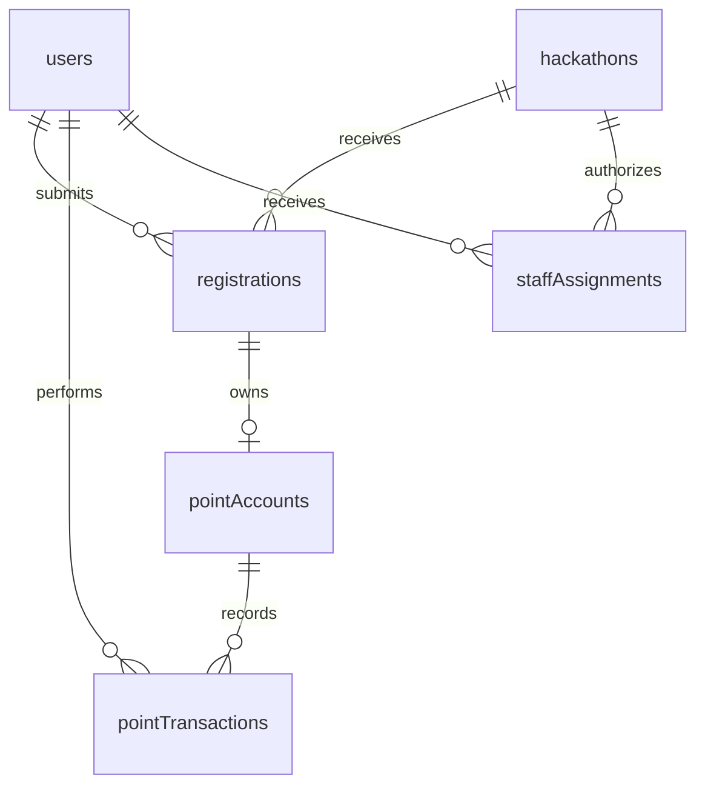

# Initial database schema

Status: local schema proposal, not deployed. Authentication, queries, mutations,
and UI integration are not implemented. The schema validates document shapes;
the business rules below must be enforced by backend functions before use.

## Relationships

Accounts persist across years. Registrations, staff permissions, and points belong
to an edition. A volunteer can also register as an attendee. A points account is
created once a registration becomes accepted, with both totals initialized to zero.
Only accepted, checked-in participants may earn or spend points in the proposed
initial policy. Organizers may perform documented corrections afterward.

## Registration and identity

- Any email domain is allowed. Verify mailbox ownership through the selected auth
  provider; student eligibility is a separate organizer decision.
- `tokenIdentifier` represents the authenticated identity, not a client-supplied
  email. Its mapping will be finalized when choosing the auth integration. Account
  linking across login methods is deferred; email matches alone must not merge users.
- One user per token identifier, one hackathon per slug, one registration per
  user/edition, one points account per registration, and one staff assignment per
  user/edition. Implement indexed lookup-and-insert in a single mutation for each.
  Indexes are not unique constraints, and typed IDs do not guarantee that referenced
  documents exist. Validate references and matching edition IDs in mutations.
- Draft answers are optional. Proposed submission requirements: full name, school,
  student status, age at the event, shirt choice, and dietary answer. An empty dietary
  array means no restrictions; an absent array means unanswered. Resume and social
  links are initially optional, pending the final registration form requirements.
- Validate age as a reasonable nonnegative integer, URLs as HTTPS links to the
  expected service, text lengths, deduplicated dietary choices, and file ownership,
  type, and size. Store resumes in Convex storage rather than in document text.
- Submission requires verified email and an open registration window. Draft moves
  to submitted; organizers may move submitted/waitlisted applications to accepted,
  waitlisted, or rejected. An applicant may withdraw. Check-in requires accepted
  status and eligible student review. Reopening and resubmission are deferred.
- Email verification, application status, eligibility, and check-in are distinct.
  Users cannot set administrative fields while saving answers. `reviewedAt` and
  `reviewedBy` capture the latest review, not a full application review audit trail.
- The current project README advertises college students aged 18+. The answer
  schema can represent other applicants, but the initial eligibility review must
  apply that published policy unless organizers change it; no email suffix proves it.
- Explicit timestamps use server-generated Unix milliseconds. Convex provides
  `_creationTime`, used as the points log timestamp; no duplicate `createdAt` field.

## Points and audit history

| Operation | balanceDelta | earnedDelta |
| --- | --- | --- |
| Award N | +N | +N |
| Purchase for N | -N | 0 |
| Refund N | +N | 0 |
| Correction or reversal | Explicit adjustment | Explicit adjustment |

`balance` is spendable points. `totalEarned` is valid earned points after award
corrections; buying and refunding merchandise never changes it. Competitions may
read either total. Reading a score does not spend points. Separate competition
scores, entry fees, inventory, and activity catalogs are deferred.

Every amount and resulting total must be a finite safe integer. At least one delta
must be nonzero. Both stored totals equal the sums of their respective transaction
deltas across the account's full history. `v.number()` alone does not enforce these
rules. Do not allow direct balance edits or unlogged initial credits.

Each points mutation must perform these steps atomically:

1. Resolve the actor from authentication and check active staff permissions for the
   edition. Verify account, registration, and related transaction ownership.
2. Look up `(pointAccountId, operationId)`. Return an existing matching result for a
   retry; reject reuse with a different operation payload. Clients must reuse the
   same key after an uncertain response. It must not be generated anew on each retry.
3. Determine allowed deltas from server-controlled awards/prices. For an activity
   awarded once, derive `awardKey` from its occurrence and reject an existing
   `(pointAccountId, awardKey)` even if another volunteer uses a different operation ID.
4. Validate status, sufficient funds, numeric limits, and any refund/reversal rules.
5. Insert the transaction and update both totals and `updatedAt` together.

History is append-only through application functions. Use `relatedTransactionId`
to link a refund, correction, or reversal to its original entry. Require a reason
and authenticated actor for every entry. An organizer correction is a signed
adjustment, not permission to silently overwrite either total.

For the initial version, support full refunds of original purchases and full
reversals of original awards only. Reject a second compensation for the same
original entry, including compensation under another type. Partial refunds and
reversing compensating entries are deferred. Award keys remain consumed after a
reversal; an organizer can make a linked correction to restore a mistaken reversal.

Routine operations must never make either total negative. If an awarded amount
has already been spent, reject a reversal that would overdraw the balance and
route it to an organizer for an explicit resolution. Never clamp a balance to zero.
The operational policy for resolving that case remains to be agreed before launch.

The log records successful changes, not failed attempts or every balance read.
Append-only application behavior does not prevent privileged dashboard edits.
Preserve account and actor references; do not cascade-delete points history when
someone withdraws or a staff assignment is deactivated. Data retention and account
deletion handling should be finalized before collecting real applicant data.

## Access and query design

Participants can read their own registration, balances, and history and edit allowed
registration answers. Volunteers can identify/check in eligible attendees and apply
approved awards or purchases. Organizers manage reviews, staff, refunds, and
corrections. Initial policy disallows volunteer self-awards and self-purchases.
Staff assignment changes are organizer-only; the first organizer needs a controlled
bootstrap when authentication is implemented.

Backend queries must return only fields needed for the caller's task. Volunteer
points access must not expose resume links, age, or dietary answers. File IDs are
references, not download URLs. Authorize resume access before issuing URLs; anyone
holding a Convex storage URL can access it. A public leaderboard, if added, should
return an explicitly approved display name and score, never whole registrations.

Indexes support registration lookups/review queues, both edition leaderboards,
account history, actor/type filters, duplicate detection, and compensation checks.
Convex appends `_creationTime` to indexes, providing chronological history without
an explicit timestamp index field. Paginate transaction history. Reconcile stored
totals against the ledger for audits, not on every balance read.

## Validation required when implementing mutations

- Duplicate signups/registrations and repeated account creation produce one record.
- Invalid draft submission fails; eligible accepted attendees can check in.
- Earn 100, spend 30, refund 30 results in balance 100 and totalEarned 100.
- Two simultaneous purchases cannot overspend an account.
- A retried request and two scans of one activity cannot double-award points.
- Duplicate refunds/reversals and cross-account references fail.
- A failed mutation leaves neither a partial totals update nor a stray log entry.
- Unauthorized users, inactive volunteers, and staff from other editions are denied.
- Corrections preserve ledger sums; overdrawing corrections fail without changes.

## References

- [Convex schemas](https://docs.convex.dev/database/schemas)
- [Indexes](https://docs.convex.dev/database/reading-data/indexes/)
- [Atomicity and concurrency](https://docs.convex.dev/database/advanced/occ)
- [Authentication in functions](https://docs.convex.dev/auth/functions-auth)
- [File storage security](https://docs.convex.dev/file-storage/overview)
